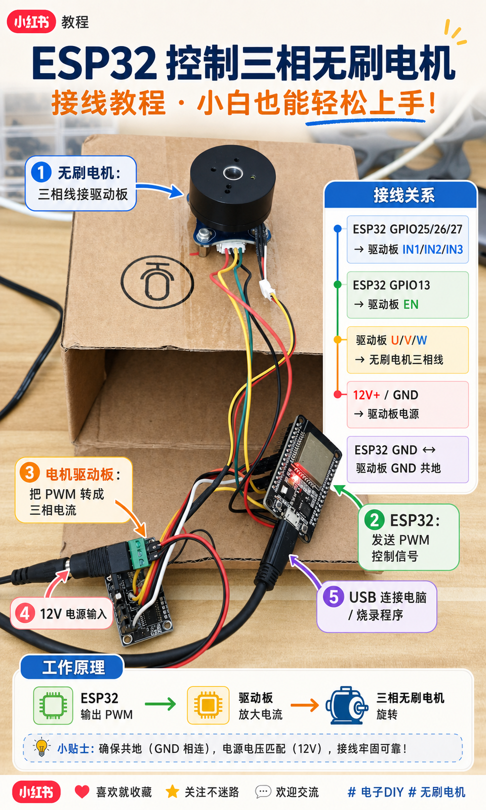

# ESP32 Brushless Motor Mixxx Platter

这是一个用 ESP32、SimpleFOC mini、AS5600 和无刷电机做的 DIY MIDI 打碟盘实验工程。



核心效果：

- Mixxx 播放时，无刷电机盘跟着转。
- Mixxx 停止时，手动转电机可以搓碟。
- 播放中给电机阻力，Mixxx 音乐会临时变慢。
- 不依赖下压/触摸传感器，靠电机速度变化判断阻力。

## 目录

```text
esp32_motor_test/src/main.cpp                    ESP32 固件
esp32_motor_test/platformio.ini                  PlatformIO 配置
esp32_motor_test/src/wifi_config.example.h       Wi-Fi 配置模板
esp32_motor_test/mac_knob_receiver.py            macOS UDP <-> CoreMIDI 桥接器
esp32_motor_test/mac_midi_monitor.py             MIDI 调试工具
esp32_motor_test/mixxx/*.xml / *.js              Mixxx 控制器映射
esp32_motor_test/HAPTIC_KNOB_USAGE.md            使用说明
assets/wiring-tutorial.png                       接线教程图
```

## 硬件接线

```text
SimpleFOC mini IN1 -> ESP32 GPIO25
SimpleFOC mini IN2 -> ESP32 GPIO26
SimpleFOC mini IN3 -> ESP32 GPIO27
SimpleFOC mini EN  -> ESP32 GPIO13

AS5600 SDA -> ESP32 GPIO21
AS5600 SCL -> ESP32 GPIO22

驱动板 U/V/W -> 无刷电机三相线
12V+ / GND  -> 驱动板电源
ESP32 GND   -> 驱动板 GND 共地
```

## Wi-Fi 配置

复制模板：

```bash
cp esp32_motor_test/src/wifi_config.example.h esp32_motor_test/src/wifi_config.h
```

编辑 `esp32_motor_test/src/wifi_config.h`：

```cpp
constexpr char WIFI_SSID[] = "你的WiFi名";
constexpr char WIFI_PASS[] = "你的WiFi密码";
```

`wifi_config.h` 已加入 `.gitignore`，不会上传到 GitHub。

## 编译和烧录

```bash
cd esp32_motor_test
pio run
pio run -t upload
```

当前本机使用过的完整命令：

```bash
cd /Users/zhaoyu/Documents/无刷电机/esp32_motor_test
PLATFORMIO_CORE_DIR=/Users/zhaoyu/Documents/无刷电机/.pio-core /Users/zhaoyu/Library/Python/3.9/bin/pio run -t upload
```

## Mixxx 映射

把映射文件复制到 Mixxx controllers 目录：

```bash
mkdir -p "$HOME/Library/Application Support/Mixxx/controllers"
cp esp32_motor_test/mixxx/ESP32-Brushless-Platter.midi.xml "$HOME/Library/Application Support/Mixxx/controllers/"
cp esp32_motor_test/mixxx/ESP32-Brushless-Platter-scripts.js "$HOME/Library/Application Support/Mixxx/controllers/"
```

在 Mixxx 中选择：

```text
Device: ESP32 Brushless Platter
Mapping: ESP32 Brushless Platter
```

## macOS MIDI 桥接器

示例启动：

```bash
/usr/bin/python3 -u esp32_motor_test/mac_knob_receiver.py \
  --midi \
  --midi-source-name "ESP32 Brushless Platter" \
  --esp32-host <ESP32_IP>
```

桥接器会创建 CoreMIDI 虚拟设备 `ESP32 Brushless Platter`，并在 Mixxx 播放时向 ESP32 发送目标转速。

## 关键参数

- `max_uq = 2.0`：电机开环驱动力度。
- `m7`：Mixxx / DJ platter 模式。
- `velocity = 6.28318530718`：约等于一秒一圈。
- 起步阶段有斜坡和短时助推，避免刚播放时抖动并拖慢音乐。

## 说明

这不是商业控制器，只是一个硬件实验项目。使用时注意电机、驱动板和电源温度，调大 `uq` 前先短时间测试。
